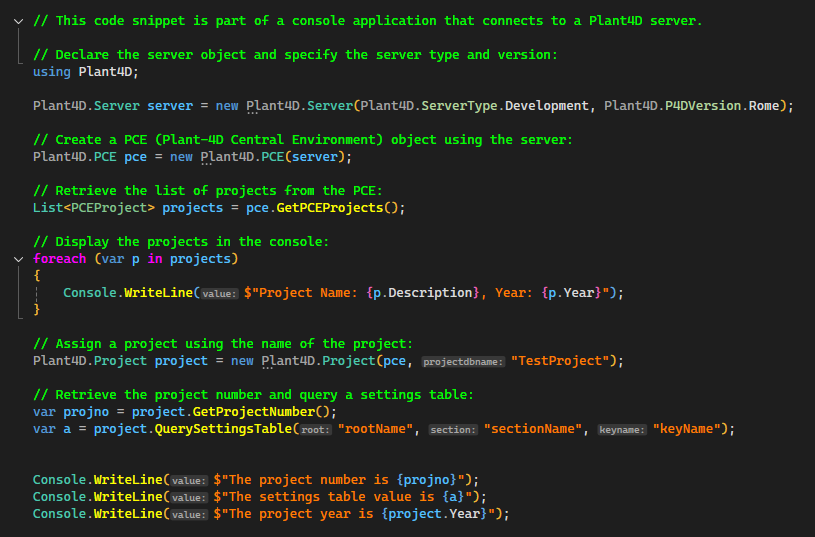

# Plant4D Class Library
This is a small class library I created to help applications connect to one of several Microsoft SQL databases that held data for the piping software "Plant-4D". 

The goal of this library is to be able to query a particular server based on whether it was production or development (represented by the enum "ServerType"), and the version of the software (this particular software used greek names, Athena and Rome, represented by the enum "P4DVersion"). Once the server was known, then a list of projects could be retrieved from that server - or if the project name was known by the user/application, it could be retrieved by name instead.

Also, the project list could be retrived based on the year of the projects (ie. all projects for the year 2019).

Once the project object was populated, it would provide common project information (official project name, description, customer name, etc.) as well as allowing to query the settings table to get other commonly needed information.

